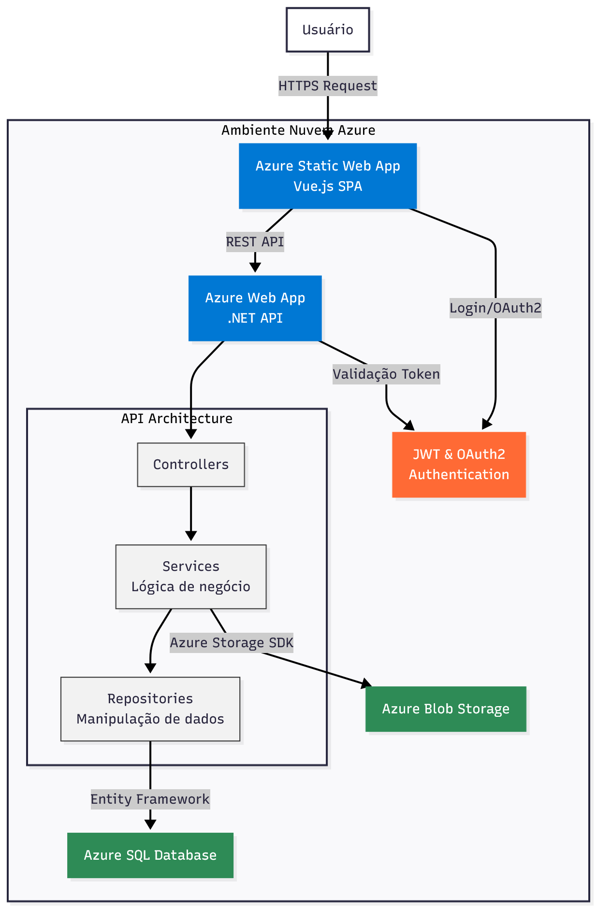

# FreelancerHub - Sistema de Controle para Freelancers

Um sistema completo para gerenciamento de clientes, projetos e finanças desenvolvido especialmente para as necessidades de freelancers.

## 📋 Visão Geral

FreelanceHub é uma solução integrada que permite aos freelancers manter controle total sobre seus negócios. O sistema oferece ferramentas para gerenciar clientes, acompanhar projetos, gerar faturas, monitorar pagamentos e gerenciar tarefas e arquivos.

- RFC: https://www.overleaf.com/read/xthqfscqnfrw#653fbd
- Projeto em prod: https://freelancerhub-portfolio.com.br/

## 🚀 Tecnologias

- **Backend**: .NET Core
- **Frontend**: Vue.js
- **Banco de Dados**: SQL Server

## Estrutura do Projeto

- [Frontend](../front-end/README.md) – Detalhes do frontend, como setup, dependências e execução.
- [Backend](../back-end/README.md) – Detalhes do backend, APIs, banco de dados e execução.

### Arquitetura do Sistema

## 🔑 Funcionalidades Principais

### Módulo de Gestão de Clientes
- Cadastro e gerenciamento de clientes
- Histórico de projetos por cliente

### Módulo de Gestão de Projetos e Entregas
- Criação e acompanhamento de projetos
- Definição de tarefas
- Acompanhamento de status e progresso
- Gestão de documentos e arquivos por projeto
- Rastreamento de horas por projeto
- Geração de documentos de cobrança por hora

### Módulo de Gestão Financeira
- Controle de invoices/faturas
- Controle de pagamentos recebidos
- Visualização de balanço financeiro

## 📝 Planos Futuros

- Integração com plataformas de freelance populares
- Sistema de cobrança integrado
- Adição de calendário público

